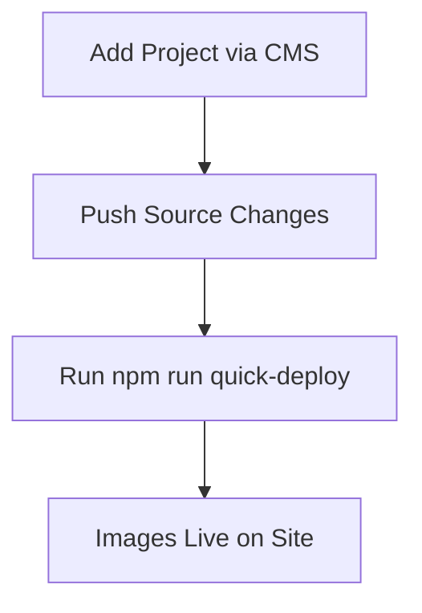

# Deployment Workaround Guide

## Current Issue
The normal `deploy.bat` script is failing due to Next.js build errors related to Html imports. This is a known issue with Next.js 13.5.1 and certain component configurations.

## Temporary Solution
Until the build issues are resolved, use the following workflow for deploying changes:

### For New Projects or Image Updates

1. **Add content via CMS** (this updates `public/data/content.json`)
2. **Push source changes to repository**:
   ```bash
   git add .
   git commit -m "feat: add new project content"
   git push
   ```

3. **Fix image paths and deploy**:
   ```bash
   npm run quick-deploy
   ```

### Manual Process (if needed)

1. **Fix image paths**:
   ```bash
   npm run fix-paths
   ```

2. **Review and commit changes**:
   ```bash
   git add docs/data/
   git commit -m "fix: update image paths for production"
   git push
   ```

## What the Scripts Do

### `npm run fix-paths`
- Scans all content.json files
- Adds `/portfolio/` prefix to image paths that need it
- Updates both source and deployed content files
- Prevents double-prefixing

### `npm run quick-deploy`
- Runs the path fixer
- Commits the changes automatically
- Pushes to GitHub Pages

## Expected Workflow



## Files Updated Automatically
- `public/data/content.json` (source)
- `docs/data/content.json` (deployed)
- `docs/data/content-*.json` (versioned deployed files)

## Future Fix
Once the Next.js build issues are resolved, you can return to using the normal `deploy.bat` script for full deployments.

## Troubleshooting

### If images still don't appear:
1. Check that files exist in `docs/uploads/` and `docs/images/`
2. Verify paths in `docs/data/content.json` have `/portfolio/` prefix
3. Clear browser cache
4. Wait 2-3 minutes for GitHub Pages to update

### If the script fails:
1. Check that Node.js is installed
2. Ensure you're in the project root directory
3. Verify the content.json files are valid JSON

## Manual Path Format
If you need to manually fix paths, ensure they follow this format:
- ❌ `/uploads/image.jpg`
- ✅ `/portfolio/uploads/image.jpg`
- ❌ `/images/image.jpg`  
- ✅ `/portfolio/images/image.jpg`
